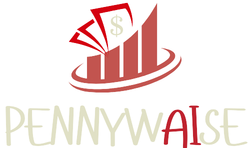
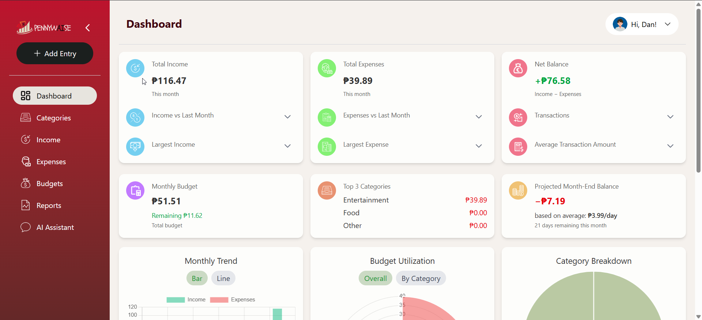
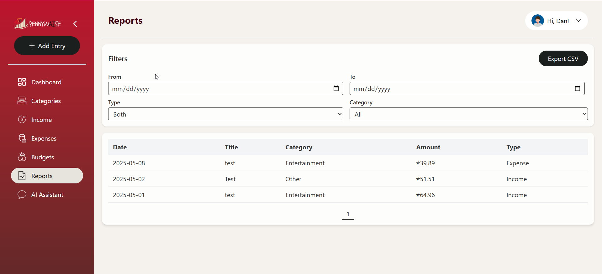

# PennywAIse

<div align="center">

[](https://www.python.org/downloads/)
[](https://www.djangoproject.com/)
[](https://tailwindcss.com/)
[](https://www.chartjs.org/)
[](https://opensource.org/licenses/MIT)
[](https://github.com/Exalt24/WebEngLongExam2)
[](https://pennywaise.onrender.com/)

</div>

<div align="center">



</div>

## 🌟 Live Demo

**Try PennywAIse today!** Access our live demo at: [https://pennywaise.onrender.com/](https://pennywaise.onrender.com/)

## 🔍 Overview

PennywAIse is a sophisticated Django-powered budgeting dashboard designed to transform how you manage your finances. Combining a sleek Tailwind CSS interface, interactive Chart.js visualizations, and cutting-edge AI-driven insights, PennywAIse makes financial management both intuitive and empowering.

Gain control of your financial future with intelligent spending analysis, personalized coaching, and visual breakdowns of your financial habits—all in one secure, user-friendly platform.

## ✨ Key Features

### 🤖 AI-Powered Financial Coaching
- **Intelligent Analysis**: Receive personalized recommendations based on your actual spending patterns
- **Subscription Optimization**: Identify redundant or underused subscription services
- **Spending Insights**: Discover trends and opportunities for savings through AI pattern recognition

### 🔐 Enterprise-Grade Security
- **Secure Authentication System**: Registration, login, and session management with industry-standard security
- **Protected Routes**: Comprehensive access control ensures data privacy
- **Encrypted Data**: All sensitive information is properly encrypted and securely stored

### 💰 Comprehensive Financial Management
- **Transaction Tracking**: Record, edit, and categorize all income and expenses
- **Custom Categories**: Organize transactions with preset or personalized categories
- **Flexible Notes**: Add context to any transaction for better record-keeping

### 📊 Data Visualization Dashboard
- **Financial Snapshot**: View your monthly balance, income, and expenses at a glance
- **Category Breakdown**: Interactive pie charts showing spending distribution
- **Trend Analysis**: Track your financial patterns with time-series visualizations
- **Comparative Statistics**: See month-to-month improvements and changes

### 🎯 Budget Planning & Alerts
- **Budget Creation**: Set monthly spending limits overall or by category
- **Alert System**: Receive notifications when approaching budget thresholds
- **Progress Tracking**: Visual indicators of budget status throughout the month

### 📤 Data Portability
- **Export Functionality**: Generate CSV exports for external analysis
- **Report Generation**: Create custom reports for specific time periods or categories

## 🖥️ Screenshots

<div align="center">

  
  <p><em>Main Dashboard with financial overview</em></p>
  
  
  <p><em>Budget management interface</em></p>
</div>

## 🚀 Installation & Setup

### Prerequisites
- Python 3.8 or higher
- Node.js 14+ and npm
- Git

### Step 1: Clone the Repository
```bash
git clone https://github.com/Exalt24/WebEngLongExam2.git
cd WebEngLongExam2
```

### Step 2: Configure Environment
Create a `.env` file in the project root with the following variables:

```dotenv
SECRET_KEY=<your-secret-key>
DEBUG=True                # Set to False in production
GMAIL_ADDRESS=<your-gmail>@gmail.com
GMAIL_APP_PASS=<your-16-char-app-password>
GENAI_API_KEY=<your-gemini-api-key>
```

#### Generate a Secure Secret Key
```bash
python -c "import secrets; print('SECRET_KEY=' + secrets.token_urlsafe(50))"
```

### Step 3: Install Dependencies
```bash
# Install frontend dependencies
npm install

# Install backend dependencies
pip install -r requirements.txt
```

### Step 4: Initialize Database
```bash
python manage.py makemigrations
python manage.py migrate
```

### Step 5: Create Test User (Development Only)
```bash
python manage.py create_test_user
# Creates user with credentials: test@example.com / password123
```

### Step 6: Launch Development Server
```bash
npm run dev
```

The application will be available at `http://127.0.0.1:8000/` with Tailwind CSS hot-reloading enabled.

## 🧪 Testing

### Running Tests
PennywAIse comes with a comprehensive test suite covering all aspects of the application:

```bash
# Run all tests
python manage.py test budget

# Run specific test modules
python manage.py test budget.tests_suite.test_models
python manage.py test budget.tests_suite.test_views
```

### Generate Coverage Report
```bash
pip install coverage
python -m coverage run --source='budget' manage.py test budget
python -m coverage report
python -m coverage html   # Generates detailed HTML report
```

## 📘 User Guide

1. **Authentication**: Register for a new account or log in with existing credentials
2. **Dashboard Overview**: View your financial summary with interactive charts
3. **Adding Transactions**: Use the sidebar form to record new income or expenses
4. **Categorization**: Assign each transaction to a category for better insights
5. **AI Insights**: Check the AI recommendations panel for personalized advice
6. **Budget Management**: Set up and monitor category-specific budgets
7. **Data Export**: Generate and download reports for external analysis

## 👥 Team & Contributions

| Team Member            | Primary Responsibilities                                       |
|------------------------|---------------------------------------------------------------|
| Amielle Jaezxier Perez | Testing framework, Models & business logic, Frontend UI        |
| Daniel Alexis Cruz     | Authentication, Email workflows, Models, Tailwind integration  |
| Nikka Joie Mendoza     | Frontend UI & refinement, Tailwind Integration                 |

## 🌐 Future Roadmap

- **Mobile Application**: Native mobile experience for iOS and Android
- **Financial Goal Setting**: Track progress toward saving and investment goals
- **Investment Portfolio Integration**: Connect and monitor investment accounts
- **Advanced AI Forecasting**: Predictive analysis of future expenses and income
- **Multi-currency Support**: Handle transactions in multiple currencies

## 📄 License

This project is licensed under the MIT License - see the [LICENSE](LICENSE) file for details.

## 🙏 Acknowledgements

- [Django](https://www.djangoproject.com/) - The web framework used
- [Tailwind CSS](https://tailwindcss.com/) - For responsive UI components
- [Chart.js](https://www.chartjs.org/) - Interactive data visualizations
- [Google Gemini AI](https://ai.google.dev/) - Powering the AI insights engine
- [Render](https://render.com/) - Application hosting platform

---

<div align="center">
  <p>Developed by the PennywAIse Team at <a href="https://github.com/Exalt24/WebEngLongExam2">Exalt24</a></p>
  <p><i>Take control of your financial future</i></p>
</div>